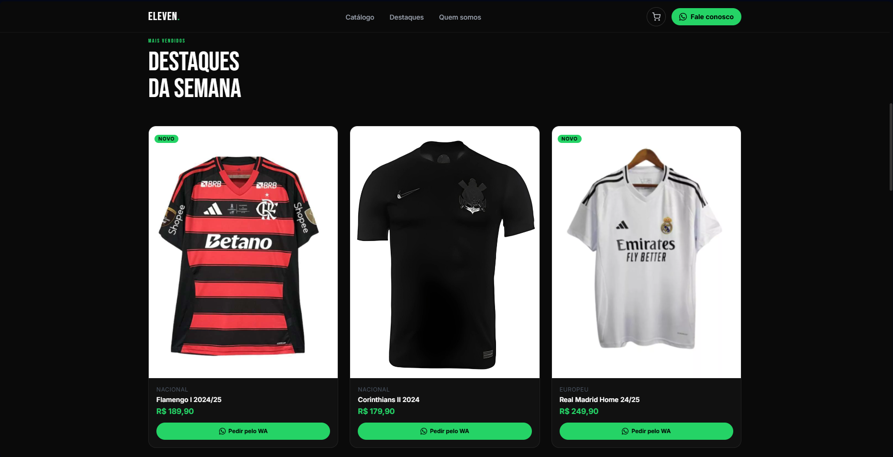

# Eleven Store

  

  Catálogo online para lojas esportivas com integração direta ao WhatsApp.

---

## Tecnologias Utilizadas
- HTML5
- Tailwind CSS
- JavaScript (Vanilla JS)
- API do WhatsApp

---

## Funcionalidades
- Catálogo de produtos esportivos
- Destaques da semana
- Carrinho de compras com persistência em Local Storage
- Integração com WhatsApp para envio de pedidos
- Layout responsivo para desktop e dispositivos móveis
- Sistema de filtros de produtos
- Interface moderna com animações e transições suaves

---

## Integração com WhatsApp
Os pedidos são enviados diretamente para o WhatsApp da loja contendo:
- Produtos selecionados
- Quantidade de cada item
- Valor total do pedido
Isso permite que o cliente finalize sua compra de forma rápida e prática, sem necessidade de cadastro ou checkout complexo.

---

## Objetivo
A Eleven Store foi desenvolvida para proporcionar uma forma simples, rápida e moderna de apresentar produtos esportivos na internet, facilitando o contato entre clientes e vendedores através do WhatsApp.
O projeto foi criado com foco em experiência do usuário, responsividade e simplicidade na realização de pedidos.

## Direitos Autorais
© 2026 Eleven Store. Todos os direitos reservados.
Este projeto é proprietário e não pode ser copiado, distribuído ou utilizado sem autorização prévia.
